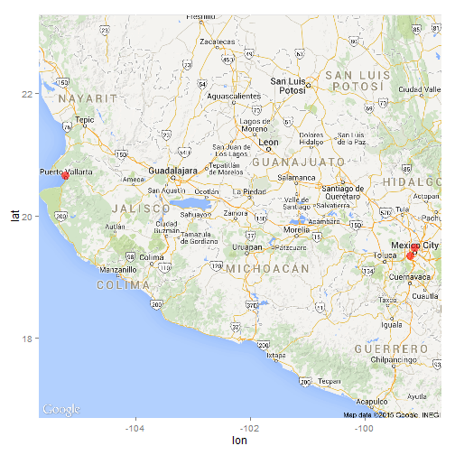

----
Title:"Primer reporte en R Markdown"
Author:"Diego Ruiz Velasco F. 131872"
output: html_document
-------

### Introducción al formato R Markdown

Ejemplo elaborado en Mon Jan 26 19:15:05 2015.


```r
library(ggmap)
```

```
## Warning: package 'ggmap' was built under R version 3.1.2
```

```
## Loading required package: ggplot2
```

```
## Warning: package 'ggplot2' was built under R version 3.1.2
```


```r
#Llenar información(sólo que esta entre"")
clave.unica<-rep("131872",3)
#1:si es mixto; 0:no lo es.
es.mixto<-c(universidad=1, preparatoria=1,secundaria=1)
#Llenar con la dirección.
universidad<-geocode("ITAM")
preparatoria<-geocode("Universidad La Salle")
secundaria<-geocode("colegio Benedictino")
#Generamos la información
educacion<-rbind(universidad, preparatoria, secundaria)
educacion<-cbind(clave.unica, es.mixto, educacion)
```


```r
limites<-make_bbox(lon, lat, educacion,f=0.7)
mapa<-get_map(location=limites,
              maptype="roadmap",
              source="google")
```

 

